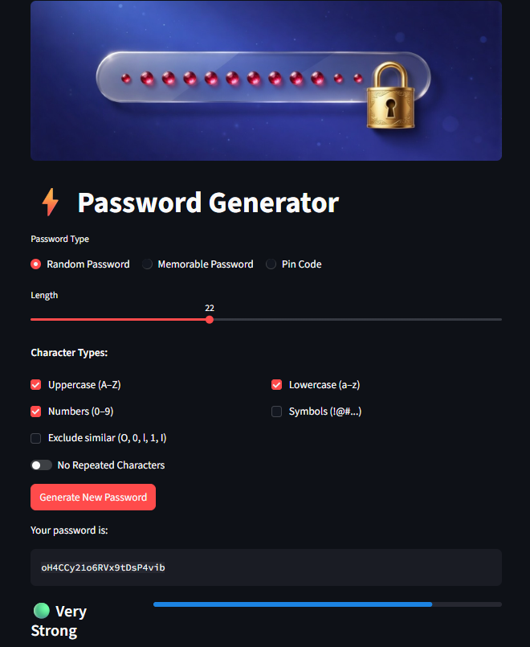

<div align="center">
  

  # 🔐 Password Generator

  [](https://www.python.org/)
  [](https://streamlit.io/)
  [](LICENSE)

  <p>
    A lightweight, secure, and privacy-first Streamlit application for generating strong passwords. Create random, memorable, or PIN-based passwords with customizable options, real-time strength evaluation, and instant downloads—all without storing anything on any server.
  </p>

  
</div>

## ✨ Key Features

- **Three Password Types**
  - **Random Password**: Cryptographically strong mix of uppercase, lowercase, digits, and symbols with options to exclude similar characters (O/0, I/1) and prevent repetition.
  - **Memorable Password**: Human-friendly passphrases using NLTK's word corpus, customizable with separators, capitalization, and numeric suffixes.
  - **PIN Code**: Secure numeric codes for banking, mobile devices, and digital safes.

- **Password Strength Evaluation**: Real-time visual indicator (Weak → Medium → Strong → Very Strong) based on length, character diversity, and complexity.
- **Flexible Customization**: Adjust length, character types, separators, and other parameters using intuitive controls.
- **Download Options**: Export generated passwords as plain TXT or detailed JSON (with type and strength metadata).
- **Dark Mode Interface**: Modern, eye-friendly design for comfortable use.
- **100% Privacy**: All passwords are generated locally, never stored, and completely forgotten on page refresh.
- **Session History**: Automatic tracking of generated passwords within your current session.

## 🚀 Quick Start

### Prerequisites
- Python 3.7+ (Recommended: Python 3.12 or higher)
- pip package manager

### Installation

1. **Clone the repository**:
   ```bash
   git clone https://github.com/Baset98/password-generator.git
   cd password-generator/src
   ```

2. **Install dependencies**:
   ```bash
   pip install -r requirements.txt
   ```
   Or install packages manually:
   ```bash
   pip install streamlit nltk
   ```

3. **Download NLTK word corpus** (Required for memorable passwords):
   ```bash
   python -c "import nltk; nltk.download('words')"
   ```

4. **Run the Application**:
   ```bash
   streamlit run dashboard.py
   ```
   The app will open in your default browser at `http://localhost:8501`.
## 📖 How to Use

1. **Select Password Type**: Choose between Random, Memorable, or PIN Code using the radio buttons.
2. **Configure Options**: Customize length, character types, separators, and other parameters.
3. **Generate**: Click the "Generate New Password" button.
4. **View & Evaluate**: See your password and its strength rating immediately.
5. **Download**: Save as TXT (password only) or JSON (with metadata).
6. **Read the Guide**: Explore password types, security tips, and privacy information in the expandable sections.
## 📁 Project Structure

```
src/
├── dashboard.py               # Main Streamlit application
├── password_generators.py     # Password generation classes
├── requirements.txt           # Python dependencies
├── README.md                  # This file
└── images/
    ├── banner.jpeg            # Application header banner
    └── streamlit-dashboard.jpeg # Dashboard screenshot
```
## 🔧 Core Components

### Password Generator Classes

Located in `password_generators.py`:

| Class | Purpose |
|-------|---------|
| `PasswordGenerator` | Abstract base class defining the generator interface. |
| `RandomPasswordGenerator` | Creates cryptographically strong random strings. |
| `MemorablePasswordGenerator` | Generates human-readable passphrases from word lists. |
| `PinCodeGenerator` | Produces secure numeric PIN codes. |
## 🛡️ Security & Privacy

### Strength Algorithm

Passwords are evaluated based on a scoring system:

- **Length**: Minimum 5 characters (40% of score)
- **Character Diversity**: Usage of uppercase, lowercase, digits, and symbols (40% of score)
- **Complexity Bonus**: Extra points for mixing digits + symbols (20% of score)

### Privacy Guarantee
✅ **Client-side Generation**: All passwords are created locally in your browser/runtime.
✅ **Zero Storage**: No passwords are saved to any database or external server.
✅ **Session-only**: History is automatically cleared when you refresh the page.
✅ **Download Privacy**: Files are generated in-memory at the moment of download.

### - Use **Random Passwords** (strongest) for critical accounts (email, banking, crypto)
- Use **Memorable Passwords** for accounts you need to type frequently
- Always store important passwords in a dedicated password manager
- Never share passwords through email or chat

## 📦 Dependencies

| Package | Version | Purpose |
|---------|---------|---------|
| `streamlit` | 1.54.0 | Web framework for building interactive applications. |
| `nltk` | 3.9.2 | Natural Language Toolkit; provides English word corpus for memorable passwords. |

**Standard library modules used**: `json`, `random`, `string`, `abc`
## 🤝 Contributing

Contributions are welcome! Please follow these steps:

1. Fork the repository
2. Create a feature branch (`git checkout -b feature/amazing-feature`)
3. Commit your changes (`git commit -m 'Add amazing feature'`)
4. Push to the branch (`git push origin feature/amazing-feature`)
5. Open a Pull Request

Please follow PEP 8 style guidelines and add tests for new features where possible.
